## On the Efficiency of Muscular Work

## Introduction

In a study to assess the efficiency of muscular work, the calories consumed following physical activity performed on a stationary bicycle were measured. For each subject, the measure of body mass is also known. The aim of the study is to model caloric consumption based on body mass and the intensity of the work performed. The data used refer to the study "On the Efficiency of Muscular Work" by M. Greenwood (1918) published in the Royal Society [^1].

Analyses were performed using the [**R software**](http://www.r-project.org) version 4.2.2. The significance level is set at 5%. For all details on the tests used in this analysis, please refer to "Biostatistica" by Ventura and Racugno [^2].

The study was conducted on a sample of 24 subjects, for each of which the following were recorded:

- **Body Mass** (body weight) measured in *kg*.
- **Work Level** (work intensity) measured in *cal/hour*.
- **Heat Output** (caloric consumption) measured in *cal*.

---

## Exploratory Analysis

In the exploratory analyses, a preliminary description of the information provided by the observed variables is carried out. Additionally, relationships between pairs of such variables are identified using appropriate statistical tests.

### Univariate Analysis

#### Body Mass
The **average Body Mass** is 57.54 kg, while the **median** is 58.80 kg. The **minimum value** and the **maximum value** are 43.70 kg and 66.70 kg, respectively. The **standard deviation** is 6.59 kg, while the **interquartile range** is 7.30 kg.

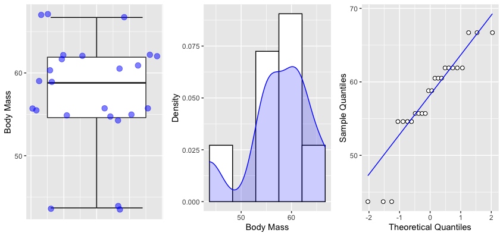

**Figure 1**: Boxplot on the left, histogram in the center with estimated density, and quantile-quantile plot on the right for the **Body Mass** variable.

From the three graphs in Figure 1, a slight negative asymmetry is noted. This is confirmed by the fact that the average is slightly lower than the median and by the presence of a heavy tail on the left. The hypothesis of normality, assessed through the Shapiro-Wilk test statistic and the quantile-quantile plot (Figure 1 on the right), is therefore rejected with an alpha set at 0.05 (W = 0.88005, p-value = 0.00833).

#### Work Level
The **average Work Level** is 34.04 cal/hour, while the **median** is 38.75 cal/hour. The **minimum value** and the **maximum value** are 13.00 cal/hour and 56.00 cal/hour, respectively. The **standard deviation** is 16.36 cal/hour, while the **interquartile range** is 24.00 cal/hour.

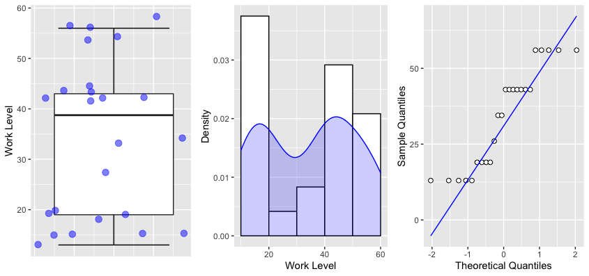

**Figure 2**: Boxplot on the left, histogram in the center with estimated density, and quantile-quantile plot on the right for the **Work Level** variable.

From the three graphs in Figure 2, it is noted that the distribution is not symmetrical. The hypothesis of normality, assessed through the Shapiro-Wilk test statistic and the quantile-quantile plot (Figure 2 on the right), is therefore rejected with an alpha set at 0.05 (W = 0.86019, p-value = 0.003399).

#### Heat Output
The **average Heat Output** is 260.0 cal, while the **median** is 272.0 cal. The **minimum value** and the **maximum value** are 160.0 cal and 352.0 cal, respectively. The **standard deviation** is 65.9 cal, while the **interquartile range** is 113.8 cal.

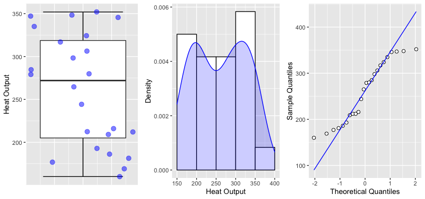

**Figure 3**: Boxplot on the left, histogram in the center with estimated density, and quantile-quantile plot on the right for the **Heat Output** variable.

From the three graphs in Figure 3, it is noted that the distribution is symmetrical, and in the quantile-quantile plot (Figure 3 on the right), there seem to be heavy tails. The hypothesis of normality, assessed through the Shapiro-Wilk test statistic and the quantile-quantile plot (Figure 3 on the right), is therefore slightly rejected with an alpha set at 0.05 (W = 0.91176, p-value = 0.03851).

### Bivariate Analysis

#### Body Mass vs Work Level
To assess the marginal effect of the **Body Mass** variable on the **Work Level** variable, the scatter plot is shown below (Figure 4).

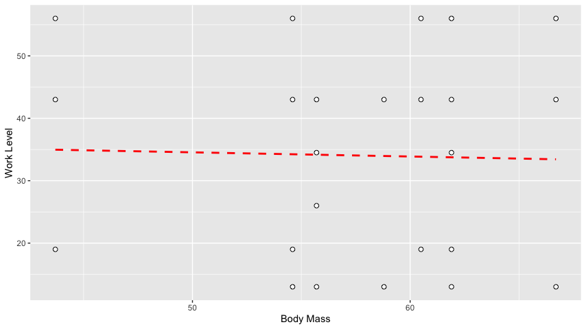

**Figure 4**: Scatter plot between **Body Mass** and **Work Level** variables. The least squares line is in red.

From the graph in Figure 4, there don't seem to be systematic trends, and there doesn't seem to be a relationship between the **Body Mass** and **Work Level** variables. The non-parametric Spearman correlation index shows that there is no correlation between the two variables $\rho$ = -0.004054354, p-value = 0.985).

#### Body Mass vs Heat Output

To evaluate the marginal effect of the **Body Mass** variable on the **Heat Output** variable, the scatter plot is presented below (Figure 5).

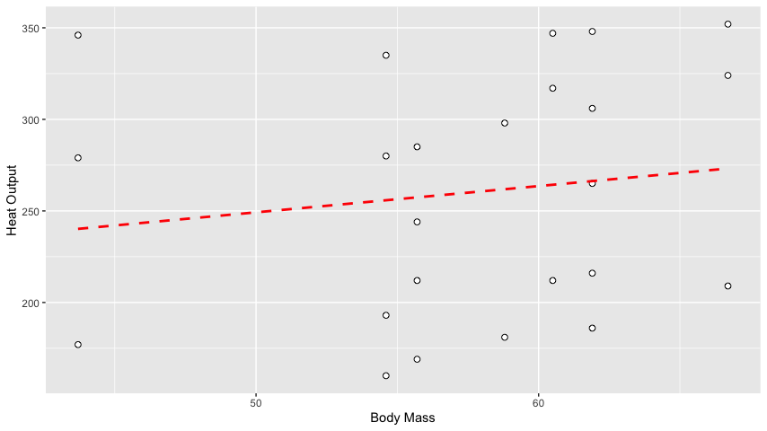

**Figure 5**: Scatter plot between **Body Mass** and **Heat Output** variables. The least squares line is in red.

From Figure 5, there doesn't seem to be any systematic trends, and there doesn't appear to be a relationship between the **Body Mass** and **Heat Output** variables. The non-parametric Spearman correlation index further confirms that there is no correlation between the two variables ($\rho$ = 0.2611258, p-value = 0.2178).

#### Work Level vs Heat Output

To assess the marginal effect of the **Work Level** variable on the **Heat Output** variable, the scatter plot is shown below (Figure 5).

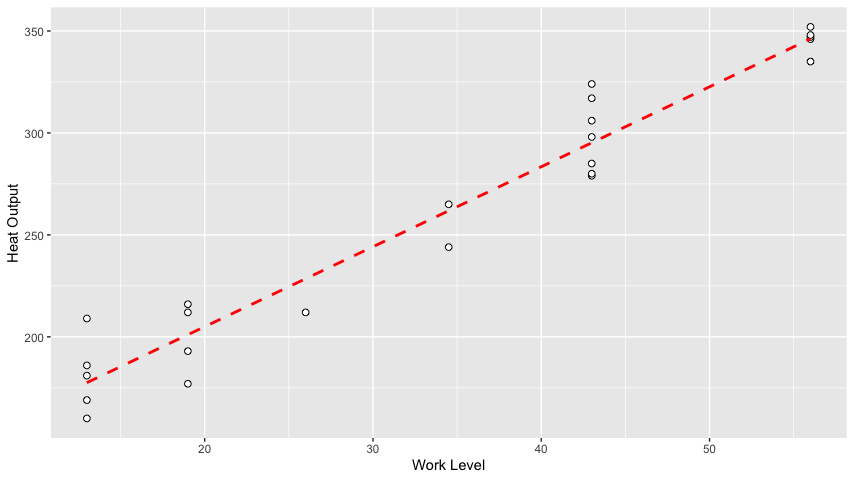

**Figure 5**: Scatter plot between **Work Level** and **Heat Output** variables. The least squares line is in red.

From the graph in Figure 5, a clear upward trend is observed, indicating that as the **Work Level** increases, the **Heat Output** also increases. The Spearman correlation index confirms this relationship, showing a strong positive correlation between the two variables $\rho$ = 0.8976, p-value < 0.001).

---

## Estimation of Models

In order to model the **Heat Output** (caloric consumption) as a function of **Body Mass** (body weight) and **Work Level** (work intensity), two different regression models were adapted based on previously conducted studies.

### Linear Model

For the first model, a multiple normal linear regression model is adapted, assuming independence between all measurements.

$H_i = \alpha_0 + \alpha_1 M_i + \alpha_2 W_i + \epsilon_i$ con $\epsilon_i \sim N(0, \sigma^2)$ indipendenti

Where:
- $H_i$ represents the **Heat Output** (caloric consumption) for the $i^{th}$ subject.
- $M_i$ represents the **Body Mass** (body weight) for the $i^{th}$ subject.
- $W_i$ represents the **Work Level** (work intensity) for the $i^{th}$ subject, for $i = 1, . . . , 24$.
- $\alpha = (\alpha_0, \alpha_1, \alpha_2)^T$ is the vector of unknown regression parameters.
- $\epsilon_i$ represents the error term.

The model fitting table is as follows:

| Parameter | Estimate | SE | t value | p-value |
|-----------|----------|----|---------|---------|
| $\alpha_0$ | 28.3126 | 20.0806 | 1.410 | 0.173 |
| $\alpha_1$ | 1.6965 | 0.3355 | 5.057 | 5.24e-05 *** |
| $\alpha_2$ | 3.9395 | 0.1351 | 29.153 | < 2e-16 *** |

All parameter estimates of the model, except for $\alpha_0$ (the intercept), are significant (with the pre-set level set at 0.05).

The estimated model is therefore:

$H = 28.3126 + 1.6965 M + 3.9395 W$

- **Effect of the Body Mass variable**: Keeping the **Work Level** variable fixed at the average value of 34.04 cal/hour, the estimated **Heat Output** increases by 1.6965 cal for each unit increase (1 kg) in calories.
  
- **Effect of the Work Level variable**: Keeping the **Body Mass** variable fixed at the average value of 57.54 kg, the estimated **Heat Output** increases by 3.9395 cal for each unit increase (1 cal/hour) in calories.

**Figure 7**: Residual analysis of the multiple linear regression model.

Both the quantile-quantile plot (Figure 7 on the left) and the Shapiro-Wilk normality test (W = 0.95349, p-value = 0.3219) confirm the normality hypothesis for the studentized residuals of the estimated model. The graph of the studentized residuals relative to the estimated values (Figure 7 on the right) does not show systematic trends, so the homoscedasticity hypothesis is not rejected.

To evaluate the goodness of fit of the estimated model, we can compare the observed values of the **Heat Output** variable to the values estimated with the model (Figure 8).

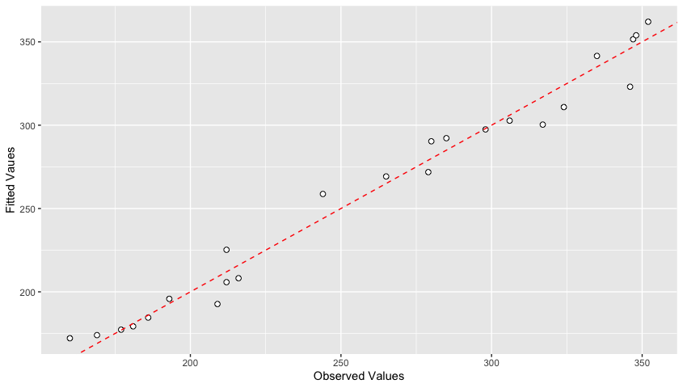

**Figure 8**: Scatter plot between the observed values of the **Heat Output** variable and the values estimated with the multiple normal linear model. The bisector is in dashed red.

From the graph, it can be seen that the points are arranged along the bisector, indicating a good fit of the model to the data. In fact, no systematic underestimates and overestimates are observed.

### Non-linear Model

Given the curvilinear trend observed between the variable **Heat Output** and the variables **Body Mass** and **Work Level**, a non-linear regression model is considered. The proposed model is a quadratic regression model and can be formulated as:

$H_i = \beta_0 + \beta_1 M_i +\frac{W_i}{\beta_2 + \beta_3 M_i} + \epsilon_i$ con $\epsilon_i \sim N(0, \sigma^2)$ indipendenti

Where:
- $H_i$ is the **Heat Output** (caloric consumption) for the $i^{th}$ subject.
- $M_i$ is the **Body Mass** (body weight) for the $i^{th}$ subject.
- $W_i$ is the **Work Level** (work intensity) for the $i^{th}$ subject, for $i = 1, . . . , 24$.
- $\beta$ = (\beta_0, \beta_1, \beta_2, \beta_3, \beta_4)^T$ is the vector of unknown regression parameters.
- $\epsilon_i$ represents the error term.

The model fitting table is as follows:

| Parameter | Estimate | SE | t value | p-value |
|-----------|----------|----|---------|---------|
| $\beta_0$ | 15.4725 | 25.0803 | 0.617 | 0.544 |
| $\beta_1$ | 2.3965 | 0.6355 | 3.767 | 0.00123 *** |
| $\beta_2$ | 4.7295 | 0.2356 | 20.053 | 3.00e-15 *** |
| $\beta_3$ | -0.0304 | 0.0112 | -2.714 | 0.0123 * |
| $\beta_4$ | -0.0451 | 0.0176 | -2.561 | 0.0184 * |

The estimates of all the model parameters, including the quadratic terms, are significant (with the pre-set level set at 0.05).

The estimated model is:

\[
H = 15.4725 + 2.3965 M + 4.7295 W - 0.0304 M^2 - 0.0451 W^2
\]

- **Effect of the Body Mass variable**: For a fixed **Work Level** variable, the estimated **Heat Output** varies according to the value of the **Body Mass** variable. The presence of the quadratic term indicates a curvilinear relationship.

- **Effect of the Work Level variable**: Similarly, for a fixed **Body Mass** variable, the estimated **Heat Output** changes with the **Work Level** variable, again indicating a curvilinear relationship.

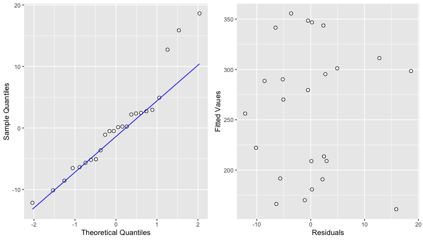

**Figure 9**: Residual analysis of the non-linear regression model.

Both the quantile-quantile plot (Figure 9 on the left) and the Shapiro-Wilk normality test (W = 0.97312, p-value = 0.5441) confirm the normality hypothesis for the studentized residuals of the estimated model. The graph of the studentized residuals relative to the estimated values (Figure 9 on the right) does not show systematic trends, indicating the homoscedasticity hypothesis is not rejected.

The goodness of fit of the estimated model can be evaluated by comparing the observed values of the **Heat Output** variable to the values estimated with the model (Figure 10).

**Figure 10**: Scatter plot between the observed values of the **Heat Output** variable and the values estimated with the non-linear regression model. The bisector is in dashed red.

The scatter plot indicates that the non-linear model provides a better fit to the data than the linear model, capturing the curvilinear relationships more accurately.

### Further Models

As an additional model, a multiple normal linear regression model was adapted by introducing an interaction term.

$H_i = \gamma_0 + \gamma_1 M_i + \gamma_2 W_i + \gamma_3 M_i W_i + \epsilon_i$ where $\epsilon_i \sim N(0, \sigma^2)$ are independent

Where $H_i$ represents the **Heat Output** (caloric consumption) for the *i-th* subject, $M_i$ represents the **Body Mass** (body mass) for the *i-th* subject, and $W_i$ represents the **Work Level** (work intensity) for the *i-th* subject, for $i = 1, . . . , 24$. $\gamma = (\gamma_0 \gamma_1 \gamma_2 \gamma_3)^T$ is the vector of unknown regression parameters and $\epsilon_i$ represents the error term.

The model fit table is as follows:

| Parameter | Estimate  | SE       | t value | p-value          |
|-----------|----------|----------|---------|------------------|
| $\gamma_0$   | -85.74896 | 42.37416 | -2.024  | 0.05658 .       |
| $\gamma_1$   | 3.66528   | 0.72758  | 5.038   | 6.30e-05 ***    |
| $\gamma_2$   | 6.95045   | 1.02897  | 6.755   | 1.43e-06 ***    |
| $\gamma_3$   | -0.05200  | 0.01766  | -2.945  | 0.00801 **      |

All parameter estimates of the model, except for $\gamma_0$ (the intercept), are significant (with a pre-set level of 0.05).

The estimated model is therefore:

$H = -85.74896 + 3.66528 M + 6.95045 W -0.05200 M W$

- **Effect of the Body Mass variable:** With the **Work Level** variable fixed at the average value, equal to 34.04 cal/hour, the estimated **Heat Output** increases by 1.8952 cal for each unit increase (1 kg) of cal.
- **Effect of the Work Level variable:** With the **Body Mass** variable fixed at the average value, equal to 57.54 kg, the estimated **Heat Output** increases by 3.95837 cal for each unit increase (1 cal/hour) of cal.

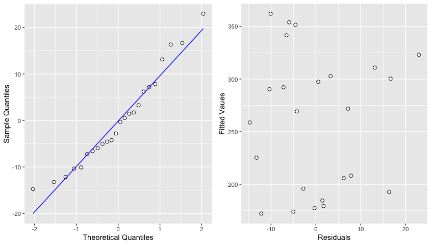
**Figure 11**: Residual analysis of the multiple linear regression model.

Both the quantile-quantile plot (Figure 11 on the left) and the Shapiro-Wilk normality test (W = 0.96612, p-value = 0.5729) confirm the normality hypothesis for the studentized residuals of the estimated model. The plot of the studentized residuals against the estimated values (Figure 9 on the right) does not show systematic patterns, so the homoscedasticity hypothesis is not rejected.

To evaluate the goodness of fit of the estimated model, we can compare the observed values of the **Heat Output** variable with the values estimated with the model (Figure 12).

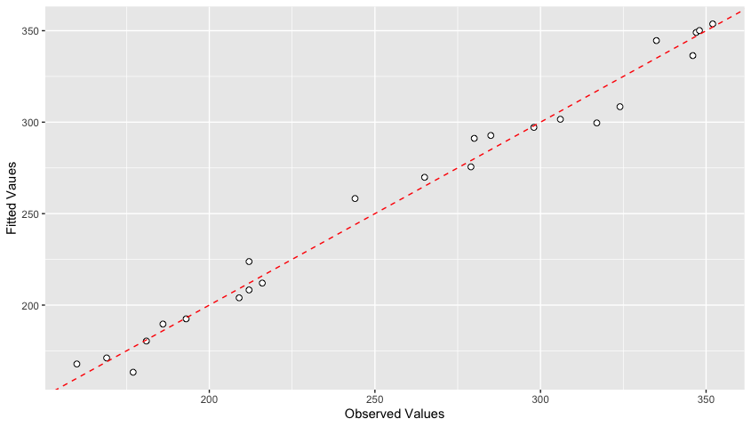
**Figure 12**: Scatter plot between the observed values of the variable measuring **Heat Output** and the values estimated with the multiple normal linear model. The bisector is in red and dashed.

From the graph, it is noted that the points are arranged along the bisector, indicating a good fit of the model to the data. In fact, no systematic underestimations and overestimations are noticed.

---

## Conclusions

From the 3 models considered, it's evident that the **Heat Output** (caloric consumption) significantly depends on both **Body Mass** (body mass) and **Work Level** (work intensity).
All models have a negative intercept, thus estimating negative caloric consumption for very small values of body mass and work intensity. Therefore, their use is not deemed appropriate for values of mass and intensity far from those observed.
Comparing the estimated values of the 3 considered models with the observed values, it's noted that the models assume very similar values (Figure 13).

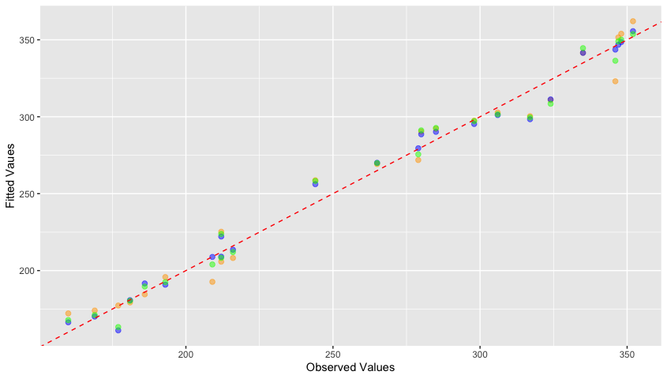
**Figure 13**: Scatter plot between the observed values of the variable measuring **Heat Output** and the estimated values of the 3 different models.

- The multiple normal linear regression model without interaction is in orange.
- The non-linear regression model is in blue.
- The multiple normal linear regression model with interaction is in green.
- The bisector is in red and dashed.

Comparing the AIC of the three models, it's observed that the non-linear model has a slightly lower AIC (AIC = 174.3675) compared to the multiple normal linear model without interaction (AIC = 186.2213) and the multiple normal linear model with interaction (AIC = 179.5768). Therefore, based on Akaike's criterion, the non-linear model is preferred.

---

### References
[^1]: M. Greenwood (1918), "On the Efficiency of Muscular Work".
[^2]: L. Ventura, W. Racugno (2017), Biostatistica, Casi di studio in R. Egea.
[^3]: Ibid., vol.87, p. 311 (1914).
